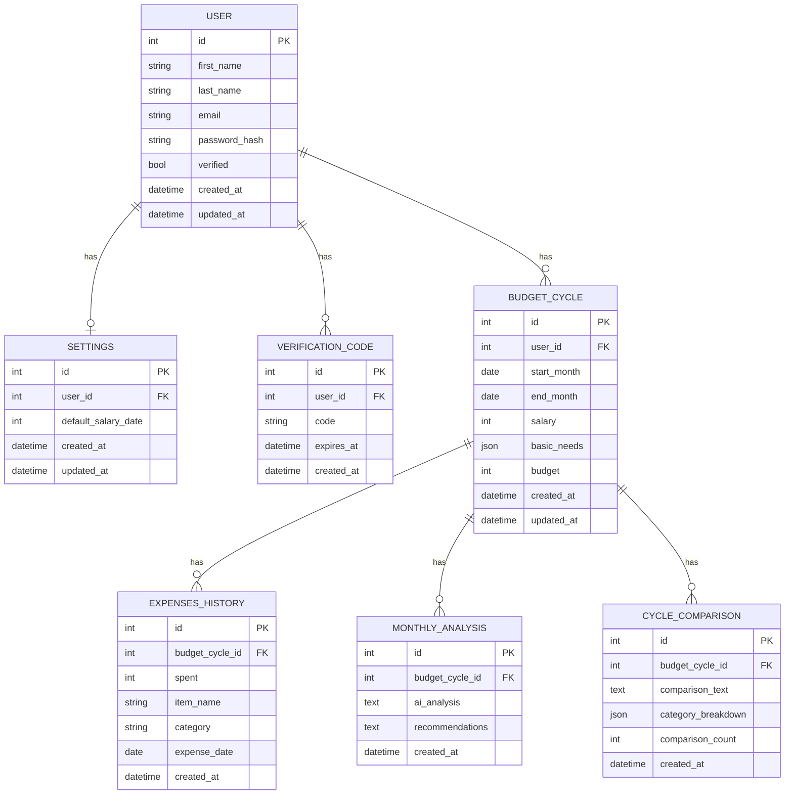

# Database schema

## Notes

- `SETTINGS` is 1:1 with `USER` — just `default_salary_date`. Salary
  and basic needs live on `BUDGET_CYCLE` instead (see decisions.md
  "Basic needs: ship a default set, not a fixed list").
- `VERIFICATION_CODE` rows are deleted by app logic on use or expiry —
  no `used` flag needed (see decisions.md "Email verification").
- `BUDGET_CYCLE.basic_needs` is JSON: a variable, user-editable list of
  `{name, amount}` items, not a fixed set of columns.
- `MONTHLY_ANALYSIS` has no cap-counter column: capped at 1/cycle, so
  "does a row exist for this `budget_cycle_id`" is the check.
  `CYCLE_COMPARISON.comparison_count` exists because its cap is 3/cycle,
  where row-presence alone can't tell you which count you're at.
- No `EXPENSES_HISTORY`/`MONTHLY_ANALYSIS`/`CYCLE_COMPARISON` table
  carries its own `user_id` — each reaches the user through
  `budget_cycle_id` instead.
